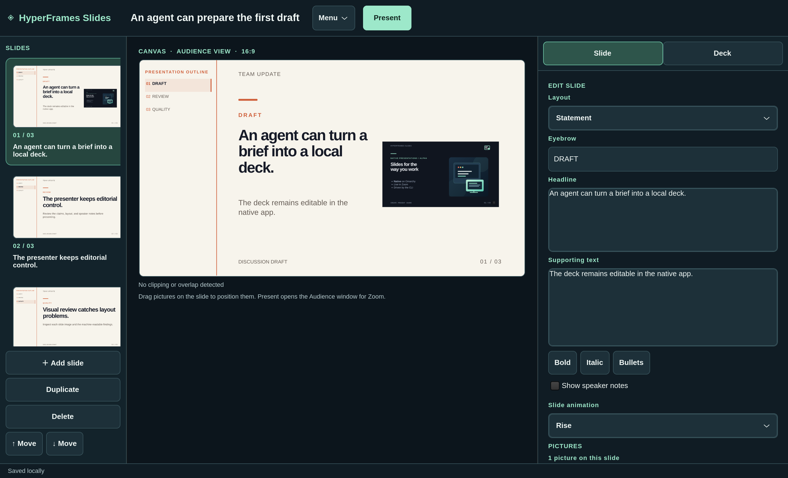
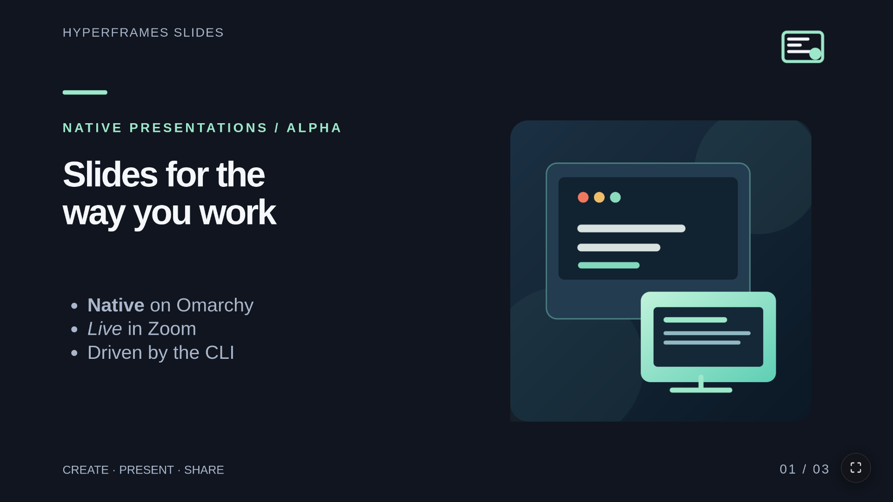

# HyperFrames Slides

A native Rust/GTK presentation editor for Omarchy. Slides render in WebKitGTK using bundled HyperFrames player assets. Presenting opens one native **HyperFrames Audience** window to share in Zoom, without Chromium, Node, `npx`, a localhost server, or a network connection.

## Screenshots

**Editor:** live slide preview, visual slide rail, picture controls, and separate Slide and Deck settings.



**Audience:** the presentation window to share in Zoom.



Decks live in `${XDG_DATA_HOME:-~/.local/share}/hyperframe-slides/decks/`. Each current deck has a small version 2 JSON manifest and a sibling `DECK_ID.assets/` directory containing pictures, logos, and fonts. Existing version 1 JSON decks still open and migrate on the next save, or with `deck migrate ID`. The editor saves drafts even when they exceed presentation limits; the status bar reports when a draft cannot be presented. Invalid rendering values and unsafe asset paths are rejected before a draft reaches the preview. The preview uses the presentation's slide markup and styling and warns about clipping and overlapping content. CLI and editor changes to the active deck sync within about a second. If a disk edit conflicts with unsaved editor work, the editor preserves its version. Closing or reloading after a failed save offers a recovery copy, explicit discard, or cancel.

For substantial agent edits, `deck bundle ID DIR` exports an editable folder with `presentation.json`, `assets/`, and `fonts/`; `deck apply-bundle ID DIR --if-revision HASH` updates the existing deck safely. `deck import-bundle DIR` creates a separate copy. `deck source` / `deck put-source` expose local storage for advanced integrations. `deck snapshot` and `deck get` provide self-contained JSON copies. See the [storage guide](docs/storage.md) for paths, migration, and recovery.

The app limits its data directories to the current user and writes decks and exported HTML with owner-only permissions. On launch it also tightens permissions on older deck files. A deck may contain private speaker notes and embedded pictures, so review a file before sharing it.

## Install

Clone this repository, then run the installer from the checkout.

GTK 4, WebKitGTK 6.0, GStreamer, and Rust/Cargo are required. The installer checks these dependencies, builds with the repository lockfile, and adds a desktop launcher. On GStreamer 1.28.7 it can place a missing `autoaudiosink` plugin under your user data directory after verifying a pinned package checksum. On other versions, install `gst-plugins-good` through Omarchy if the installer asks for it.

```bash
./install.sh
```

Launch **HyperFrames Slides** from Omarchy's app launcher or run `~/.local/bin/hyperframe-slides`.

To update from a source checkout, pull the latest changes and run `./install.sh` again. To remove the application and launcher while keeping your decks, run `./uninstall.sh` from the checkout.

## Author slides

- The **Supporting text** field accepts Markdown: `- item` for bullets, `1. item` for numbered lists, `**bold**`, and `*emphasis*`. The Bold, Italic, and Bullets buttons insert the corresponding markup. Headline text also supports bold and emphasis.
- **Insert picture** opens a file chooser. You can also drop multiple PNG, JPEG, GIF, or WebP files onto the picture drop area, use **Paste picture** for a copied image, or press Ctrl+V when focus is outside a text field. Drag an inserted picture in the preview to place it. Pictures are stored as local assets and embedded in HTML exports, so they remain available offline. The editor arranges up to eight pictures on one slide; agents can set each picture's `x`, `y`, `width`, and `height` percentages through the CLI or deck JSON.
- **Menu → Overview** or Ctrl+G opens a visual grid of the whole deck. Ctrl-click to select several slides for duplicate or delete, drag a card before another card to reorder, and double-click or press Enter on a focused card to return to the editor.
- The **Deck** tab sets a shared header, footer, logo, optional presentation outline, and embedded WOFF2 heading/body fonts. The outline appears on the left in the preview and audience window. Adjacent slides with the same **Outline section** appear as one heading, which stays highlighted as those slides advance. The active heading shows progress within its section. While presenting, click a section heading to jump to its first slide (or focus it and press Enter or Space). Leave the field blank to derive a heading from the eyebrow text. The logo uses **Set logo** or `template logo` in the CLI. The Regent College theme uses the colours of Regent's current website. Brand fonts are stored in individual local decks rather than the public application source.
- **Slide animation** offers None, Fade, Rise, and Zoom. Each slide stores its choice in the `animation` field. On slide changes, the heading and body play their eased entrance in the audience window. Pictures fade in without moving and finish when the heading does. Logos, template headers, footers, and the outline appear in place. Reduced-motion settings skip the entrance.
- **Quiz** layout supports up to three reveal choices. Enter one choice per line in **Reveal options**; each press of Next shows the next choice, and another press advances the slide. Agents can set the slide's `revealOptions` array with `slide set` or an editable bundle.
- **Slide sound** offers None or Modem connection. The sound plays once when the slide is entered, stops when leaving, and follows the presentation mute control. The recording is bundled for offline playback. Agents can use `slide sound DECK_ID SLIDE_ID modem` or `none`.
- **Speaker notes** are stored with each slide. Their editor field starts hidden; use **Show speaker notes** to edit them. Notes are excluded from the audience window.

The editor requests WebKitGTK hardware acceleration and enables WebGL. On this Omarchy machine, the native WebKit processes were verified using the AMD DRM render node. `present gpu SESSION_ID` reports live render-node use; WebKit may mask the WebGL renderer name.

## Present in Zoom

1. Create a deck, choose a layout and theme, and add speaker notes. **Menu → Import bundle** browses for a presentation bundle folder; **Menu → Recent** lists decks already in the app. Imported bundles become new local decks. Open a starter deck and choose **Menu → Duplicate deck** to make an editable copy without changing the starter.
2. Click **Present** or press Ctrl+P.
3. Share the **HyperFrames Audience** window in Zoom. Keep it visible, ideally on a second monitor.

The audience window opens floating and centered on Omarchy, ready to resize or share in Zoom. Navigate with its controls, arrow keys, or the CLI. Each presentation uses an immutable in-memory snapshot, so a deck edited after presentation starts cannot silently alter an ongoing session. Present again to use the updated deck. Speaker notes remain in the editor and deck JSON but are excluded from the audience session.
Press **Escape** in the audience window to stop the slideshow and close it.

## Agent and CLI use

Every deck field and slide operation can be controlled through the CLI. Data commands emit JSON on stdout and errors as JSON on stderr. `-` reads JSON from standard input. `deck source` and `deck snapshot` return a matching SHA-256 revision. When replacing an existing deck or slide, pass that revision with `--if-revision` so an agent cannot silently overwrite a newer edit. Scoped commands such as `slide animation` apply to the current deck under the same writer lock used by the editor. Run `hyperframe-slides schema` for a command list, `hyperframe-slides help authoring` for the agent guide, or `hyperframe-slides skill install` to install the short authoring skill. See the [agent authoring guide](docs/agent-authoring.md) for a brief-to-deck example and visual review loop.

For a new deck ID, `deck put deck.json` creates the deck without a revision. Read `deck snapshot ID` immediately before editing an existing deck, then use its `revision` value for `deck put` or `slide set`.

Use **Import bundle** (Ctrl+O) to choose a presentation bundle folder in the editor, or `hyperframe-slides deck import-bundle DIR` in the CLI. Existing library decks open through **Recent**.

Previous saved revisions are retained locally. **Menu → Version history** or `deck history ID` lists them. **Menu → Review changes** shows changed slides side by side and can revert one slide. `deck diff ID HISTORY_HASH DIR` creates before/after PNGs and `diff.json` with change summaries and layout findings; `deck revert-slide ID HISTORY_HASH SLIDE_ID --if-revision CURRENT_HASH` restores one slide. `deck restore ID HISTORY_HASH --if-revision CURRENT_HASH` restores the whole version. Reverts and restores preserve the current version in history.

```bash
hyperframe-slides deck new "Quarterly update"
hyperframe-slides deck list
hyperframe-slides deck get DECK_ID
hyperframe-slides deck snapshot DECK_ID
hyperframe-slides deck source DECK_ID
hyperframe-slides deck put-source source.json --if-revision REVISION
hyperframe-slides deck bundle DECK_ID ./editable-bundle
hyperframe-slides deck apply-bundle DECK_ID ./editable-bundle --if-revision REVISION
hyperframe-slides deck import-bundle ./editable-bundle
hyperframe-slides deck history DECK_ID
hyperframe-slides deck put deck.json --if-revision REVISION
hyperframe-slides slide add DECK_ID slide.json
hyperframe-slides slide duplicate DECK_ID SLIDE_ID
hyperframe-slides slide set DECK_ID SLIDE_ID slide.json --if-revision REVISION
hyperframe-slides slide move DECK_ID SLIDE_ID 2
hyperframe-slides slide delete DECK_ID SLIDE_ID
hyperframe-slides slide animation DECK_ID SLIDE_ID zoom
hyperframe-slides image add DECK_ID SLIDE_ID picture.png "Alt text"
hyperframe-slides image remove DECK_ID SLIDE_ID IMAGE_ID
hyperframe-slides image position DECK_ID SLIDE_ID IMAGE_ID 54 28 38 50
hyperframe-slides image background DECK_ID SLIDE_ID IMAGE_ID on
hyperframe-slides template header DECK_ID "Company name"
hyperframe-slides template footer DECK_ID "Confidential"
hyperframe-slides template outline DECK_ID on
hyperframe-slides template theme DECK_ID regent
hyperframe-slides template logo DECK_ID logo.png
hyperframe-slides template logo-clear DECK_ID
hyperframe-slides template font DECK_ID heading heading.woff2
hyperframe-slides template font DECK_ID body body.woff2
hyperframe-slides deck new "New Regent talk" --from TEMPLATE_DECK_ID
hyperframe-slides deck validate DECK_ID
hyperframe-slides deck review DECK_ID ./review-output
hyperframe-slides deck render DECK_ID SLIDE_ID ./one-slide-review
hyperframe-slides deck diff DECK_ID HISTORY_HASH ./visual-diff
hyperframe-slides deck revert-slide DECK_ID HISTORY_HASH SLIDE_ID --if-revision CURRENT_HASH
hyperframe-slides deck export DECK_ID ./export
hyperframe-slides deck export-audience DECK_ID ./audience-export
hyperframe-slides deck present DECK_ID
hyperframe-slides present list
hyperframe-slides present status SESSION_ID
hyperframe-slides present gpu SESSION_ID
hyperframe-slides present inspect SESSION_ID
hyperframe-slides present inspect-audience SESSION_ID
hyperframe-slides present next SESSION_ID
hyperframe-slides present prev SESSION_ID
hyperframe-slides present goto SESSION_ID 3
hyperframe-slides present audience SESSION_ID
hyperframe-slides present audience-close SESSION_ID
hyperframe-slides present close SESSION_ID
```

`deck review` uses offscreen WebKitGTK to save every slide as a PNG, a contact sheet, and a structured `report.json` with clipping, overlap, and missing-picture findings. It opens no visible window and requires a graphical session. A clean report still needs human review of claims and design. `deck present` prints a `session` ID before opening the audience window. An agent can run it as a background process, then use the `present` commands from another process to inspect and control the live deck. `goto` uses 1-based slide numbers. `present status` reports its state and slide number. `present inspect` and `present inspect-audience` inspect the same audience window and report visible scenes, headline and body visibility, text entrance activity and opacity, viewport bounds, picture loading and opacity, and overlapping content regions. The control socket is local to the user, lives under the app's data directory, and is removed when the audience window closes. GUI-launched presentations also appear in `present list`. The old `--audience` flag remains a compatibility alias.

`deck export` includes presenter metadata and speaker notes. Use `deck export-audience` when distributing HTML to an audience; it omits speaker notes. Exports are HyperFrames compositions. They can be opened by the HyperFrames CLI, which is optional for the native application. The compatibility alias `hyperframe-slides --export DECK_ID DIRECTORY` remains available.

The embedded runtime is pinned to HyperFrames `0.8.78` and GSAP `3.15.0`; see [vendor assets](assets/vendor/README.md). Exported standalone HTML still references GSAP from a CDN, so the standalone export is not guaranteed to run offline. The native audience window uses the bundled copy.

## Release checks

```bash
cargo fmt --check
cargo test --quiet
cargo clippy --quiet -- -D warnings
cargo build --release --locked
bash -n install.sh uninstall.sh tests/live-presenter.sh tests/agent-review.sh
./tests/live-presenter.sh ~/.local/bin/hyperframe-slides-launch
bash ./tests/agent-review.sh ~/.local/bin/hyperframe-slides
git diff --check
```

The app code is [MIT licensed](LICENSE). Bundled runtime licenses are listed with the [vendor assets](assets/vendor/README.md).

Agents can mute or unmute a live presentation with `present sound SESSION off` or `on`.

### Bullet reveals

Enable **Fade in bullets one at a time (click / Space)** for a slide in the editor, or run `hyperframe-slides slide bullets DECK_ID SLIDE_ID on` (`off` disables it). The optional `revealBullets` boolean defaults to false. Each click on the slide, Space, Right arrow, or CLI `present next` reveals one top-level Markdown list item, including its nested supporting bullets. After the last item, Next advances to the next slide. Static previews and PDF export show all items.
